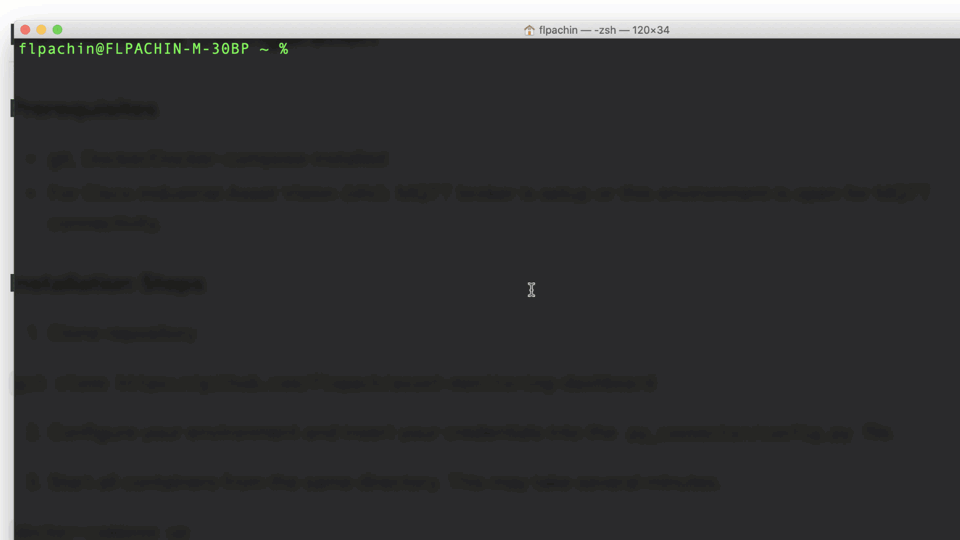
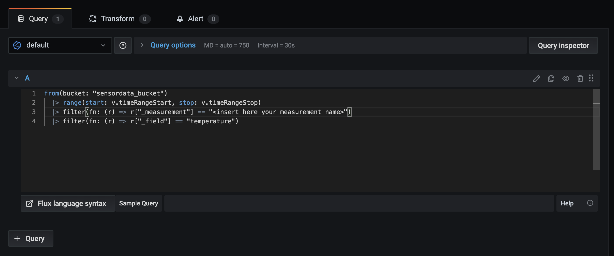
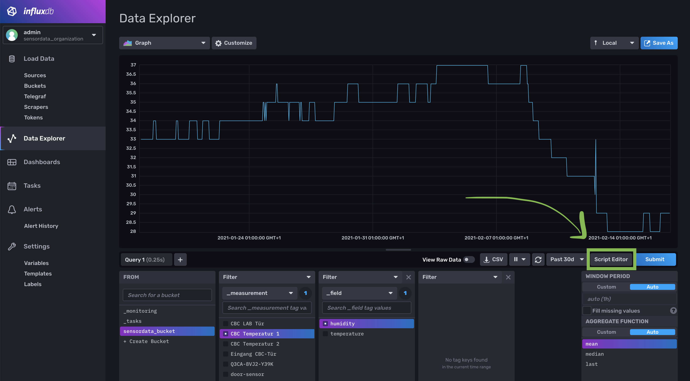

# Asset Monitoring Dashboard: Meraki IoT + Industrial Asset Vision

> NEW UPDATE: Support of the updated IAV MQTT JSON schema

2in1 Dashboard: Simply install your own dashboard anywhere within minutes with **Docker-Compose**, **InfluxDBv2** time series database and **Grafana** dashboard.

* **Meraki MT sensors** – ideal for Meraki network users to monitor indoor IT facilities like network closets
* **Cisco Industrial Asset Vision sensors** – a new IoT solution that integrates together new Cisco sensors, an Cisco IoT gateway and a new cloud-based dashboard to monitor OT assets and facilities in outdoor and industrial indoor spaces

> **[Check also out the YouTube demo video](https://youtu.be/XDs7jbah5L8)**


## Features

* Deploy the whole environment within minutes via Docker-Compose
* Pre-built Grafana dashboard
* Data will remain in the project folder even after the containers are shut down (using Docker Volumes)
* All Meraki sensor types are supported.
* Historical Meraki MT sensor data will be downloaded.
* All IAV sensor types are supported except the GPS sensors.
* The connector script is only compatibel with InfluxDB 2.x



## Installation & Configuration

### Prerequisites

* git, Docker/Docker-compose installed
* For Cisco Industrial Asset Vision (IAV): MQTT broker is setup or this environment is open for MQTT connectivity.

### Installation Steps

1. Clone repository

```git clone https://github.com/flopach/asset-monitoring-dashboard```

2. Configure your environment and insert your credentials into the `py_connector/config.py` file (for more information see the configuration details below).

3. Start all containers from the same directory. This may take several minutes.

```docker-compose up```

More useful commands:

* Run as daemon mode: `docker-compose up -d`
* Stops containers: `docker-compose down`
* Build again the containers (when you changed the Python scripts): `docker-compose build`


### Configure: config.py
Simply open `py_connector/config.py` in any text-editor and put in the credential data of your Cloud instances:

**Meraki Dashboard API**: If you are unfamiliar of how to get your Meraki API key or what your Meraki network ID is, [take a look at this documentation](https://developer.cisco.com/meraki/api-v1/#!getting-started).

**IAV MQTT Settings**: At first you need to setup in your Industrial Asset Vision tenant where your sensor data should be sent to. You can find more information [in the documentation](https://developer.cisco.com/docs/iotod/#!stream-sensor-data). You can either get a free or paid cloud based MQTT broker or run this container-stack where you can open the required MQTT-port and have a public IP available.

After you have setup your MQTT broker, you can easily put the credentials in the `config.py` file.


### Configure: Dashboards

Login to Grafana dashboard and configure your dashboard modules by easily inserting the measurement name. Additionally, use the query editor from the InfluxDB UI as a help to copy the Flux language syntax.

Login **Grafana** - [http://localhost:3000](http://localhost:3000)

* username: admin
* password: admin123



Login **InfluxDB** - [http://localhost:8086](http://localhost:3000)

* username: admin
* password: admin123



### Configure: docker-compose.yml (optional)
If you are not familiar with Docker compose, go ahead to check the [documentation](https://docs.docker.com/compose/). Basically, 4 containers will be spun up:

* InfluxDBv2: data will be stored outside of the container
* InfluxDBv2 CLI setup instance: Will setup the other InfluxDBv2 container if it is not setup yet
* Grafana Dashboard: configuration settings will be stored outside of the container
* Py connector: Python connector scripts (stored in the `py_connector` folder)
* Mosquitto (optional): uncomment to enable Mosquitto MQTT broker


## Versioning

**1.1** (Apr 2021) - Updated to support new IAV MQTT JSON schema, various bugfixes

**1.0** (Feb 2021) - Initial version


## License

This project is licensed under the MIT License - see the [LICENSE.md](LICENSE.md) file for details

## Further Links

* [Cisco DevNet Website](https://developer.cisco.com)
* [Industrial Asset Vision Documentation](https://developer.cisco.com/docs/iotod/#!introduction)