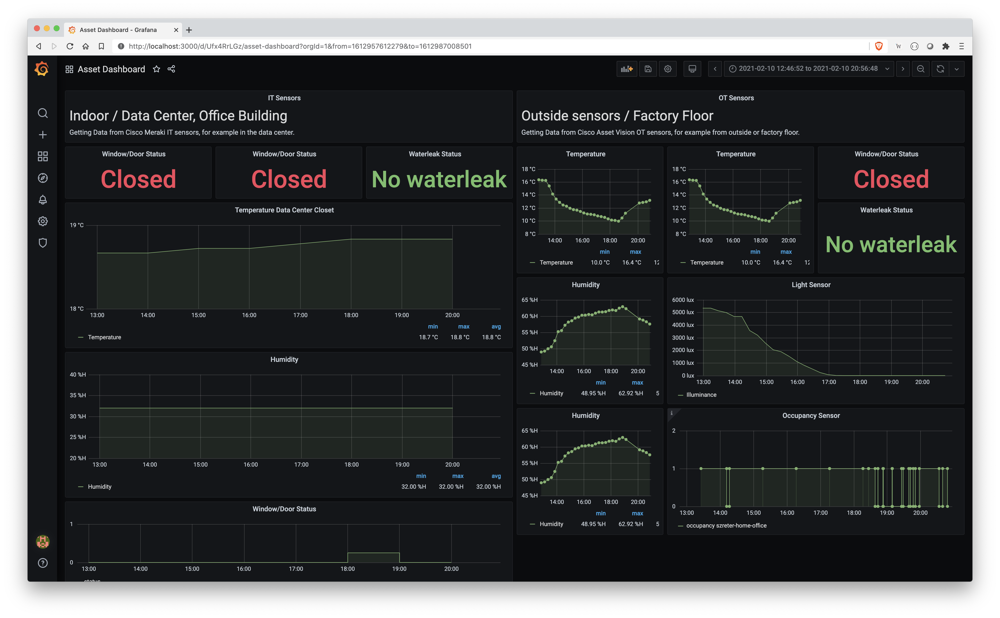

# Asset Monitoring Dashboard: Meraki IoT + Industrial Asset Vision

2in1 Dashboard: Simply install your own dashboard anywhere within minutes.

* **Meraki MT sensors** – ideal for Meraki network users to monitor indoor IT facilities like network closets
* **Cisco Industrial Asset Vision sensors** – a new IoT solution that integrates together new Cisco sensors, an Cisco IoT gateway and a new cloud-based dashboard to monitor OT assets and facilities in outdoor and industrial indoor spaces





## Features

* Deploy the whole environment within minutes via Docker-Compose
* Pre-built Grafana dashboard
* Data will remain in the project folder even after the containers are shut down (using Docker Volumes)
* All Meraki sensor types are supported.
* Historical Meraki MT sensor data will be downloaded.
* All IAV sensor types are supported except the GPS sensors.

## Installation & Configuration

### Prerequisites

* git, Docker/Docker-compose installed
* For Cisco Industrial Asset Vision (IAV): MQTT broker is setup or this environment is open for MQTT connectivity.

### Installation Steps

1. Clone repository

```git clone https://github.com/flopach/asset-monitoring-dashboard```

2. Configure your environment and insert your credentials into the `py_connector/config.py` file.


3. Start all containers from the same directory. This may take several minutes.

```docker-compose up```

Can also run in daemon mode: `docker-compose up -d`

### Configuration 

Login to Grafana dashboard and configure your dashboard modules by easily inserting the measurement name. Additionally, use the query editor from the InfluxDB UI as a help to copy the Flux language syntax.

Login **Grafana** - [http://localhost:3000](http://localhost:3000)

* username: admin
* password: admin123


Login **InfluxDB** - [http://localhost:8086](http://localhost:3000)

* username: admin
* password: admin123


## Versioning

**1.0** (Feb 2021) - Initial version.


## License

This project is licensed under the MIT License - see the [LICENSE.md](LICENSE.md) file for details

## Further Links

* [Cisco DevNet Website](https://developer.cisco.com)
* [Industrial Asset Vision Documentation](https://developer.cisco.com/docs/iotod/#!introduction)